# 3d-reconstruction-colmap

This project demonstrates **multi-view 3D reconstruction** using [COLMAP](https://colmap.github.io/).  
The dataset used here is **DTU Scan6**, part of the [DTU Robot Image Dataset](http://roboimagedata.compute.dtu.dk/).

## 🚀 Pipeline Overview
The reconstruction process follows these main steps in COLMAP:

1. **Feature Extraction** – detect keypoints and descriptors.  
   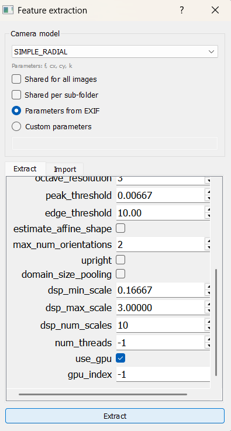

2. **Feature Matching** – match features across all image pairs.  
   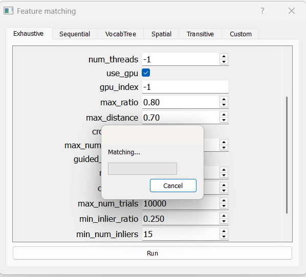

3. **Sparse Reconstruction (SfM)** – estimate camera poses and build a sparse point cloud.  
   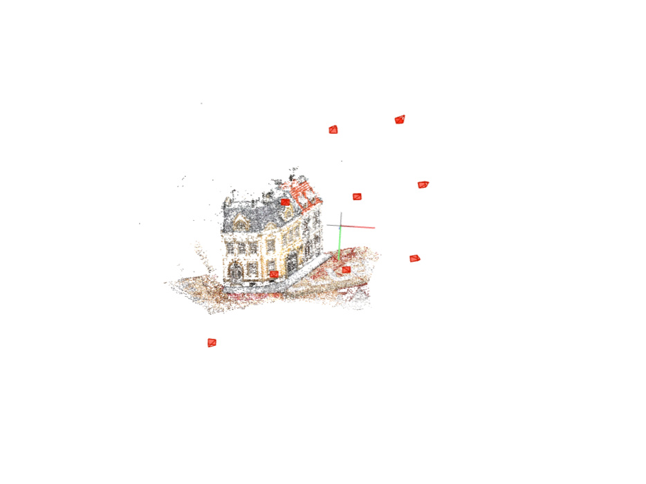
   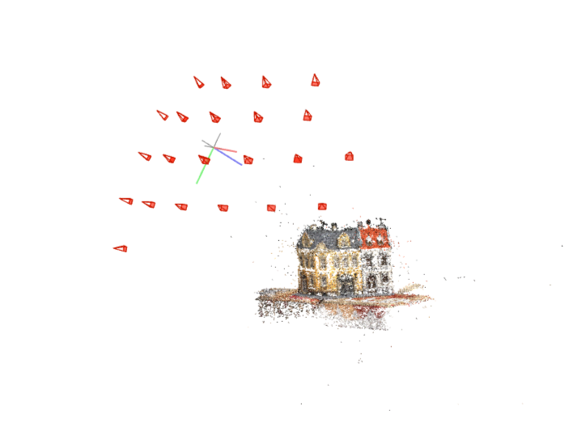
   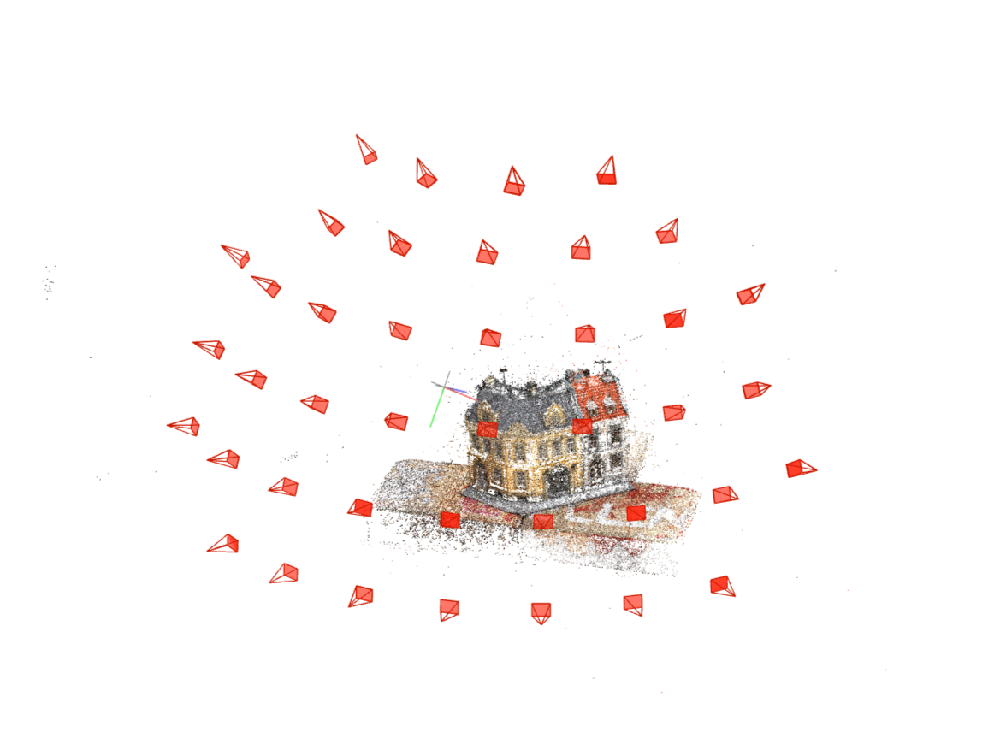
   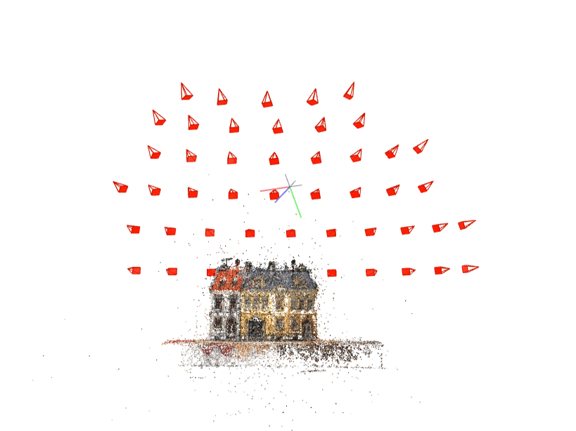

4. **Dense Reconstruction (MVS)** – create a dense point cloud from multi-view stereo.  
   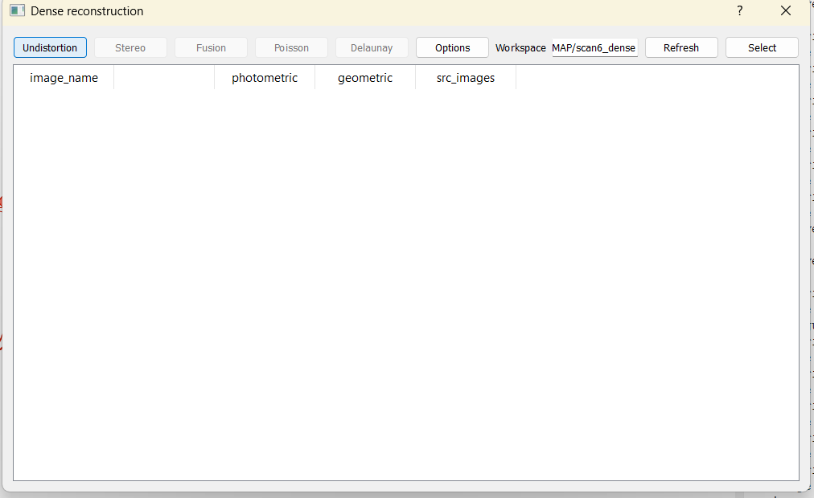
   
   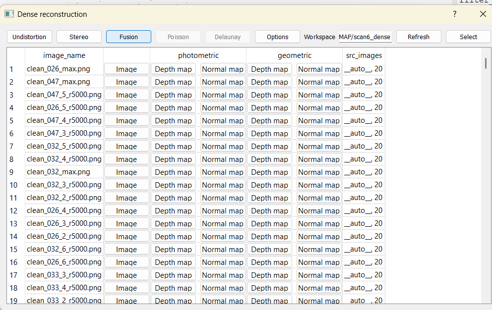

5. **Final Dense point cloud**  
   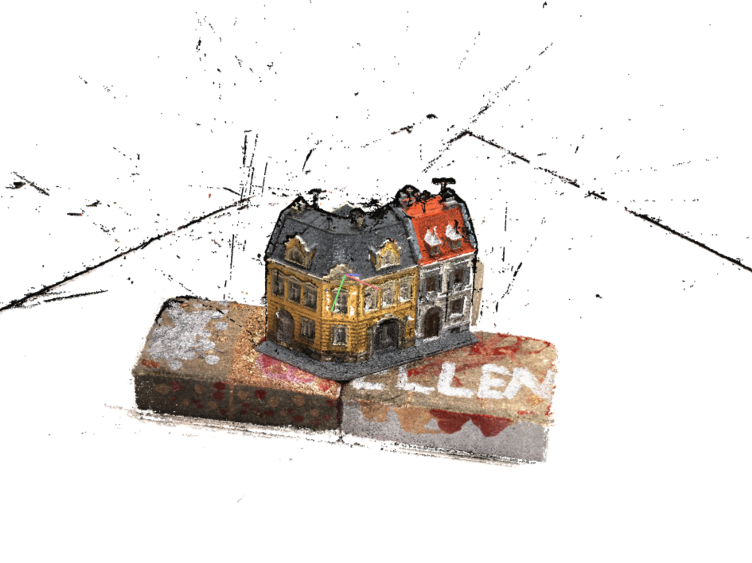
   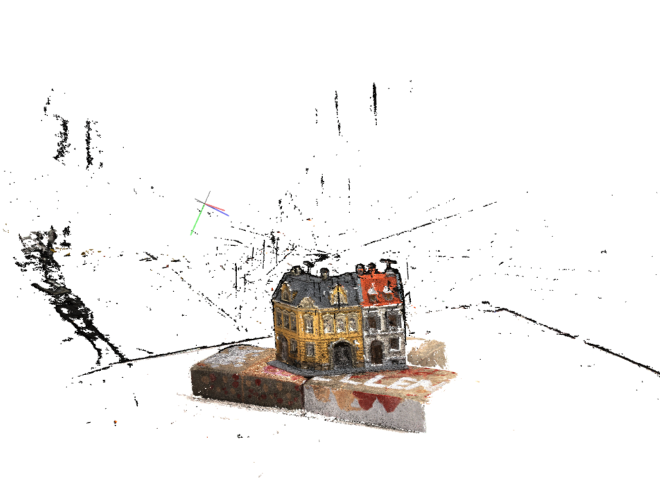
   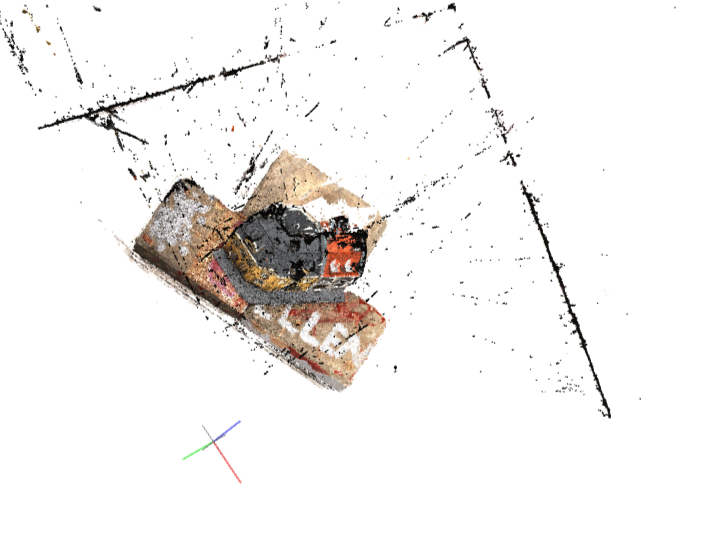
