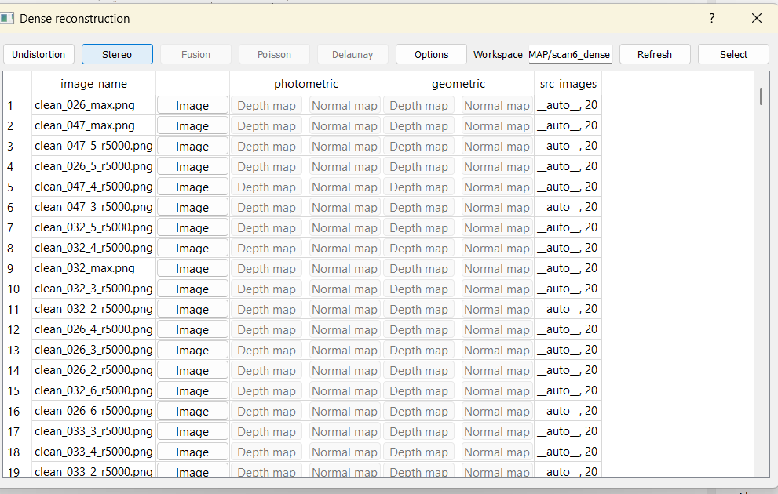

# 3d-reconstruction-colmap

This project demonstrates **multi-view 3D reconstruction** using [COLMAP](https://colmap.github.io/).  
The dataset used here is **DTU Scan6**, part of the [DTU Robot Image Dataset](http://roboimagedata.compute.dtu.dk/).

## 🚀 Pipeline Overview
The reconstruction process follows these main steps in COLMAP:

1. **Feature Extraction**  
   Goal: detect keypoints and compute descriptors (I used SIFT).  
   Input: images and a COLMAP database (database.db).  
   Output: features stored in the database.
     
   

2. **Feature Matching**  
   Goal: match descriptors across different image pairs.  
   Input: database with features.  
   Output: matches stored in the database.
     
   

3. **Sparse Reconstruction (SfM)**
   Goal: estimate camera poses and build a sparse point cloud using triangulation.  
   Input: database with matches + images.  
   Output: cameras.bin, images.bin, points3D.bin
     
   
   
   
   

4. **Dense Reconstruction (MVS)**  
      4-1. ***Image Undistortion***  
      Goal: undistort images based on SfM calibration for dense reconstruction.  
      Input: sparse model + original images.  
      Output: workspace with undistorted images and configs.  
         
      

      4-2. ***Dense Reconstruction***  
      Goal: compute dense depth maps for each image.  
      Input: undistorted images.  
      Output: depth maps and stereo results.  
       
      

      4-3 ***Stereo Fusion***  
      Goal: merge all depth maps into a single fused dense point cloud.  
      Input: PatchMatch results.  
      Output:  point cloud.
     
      
      
      
      
